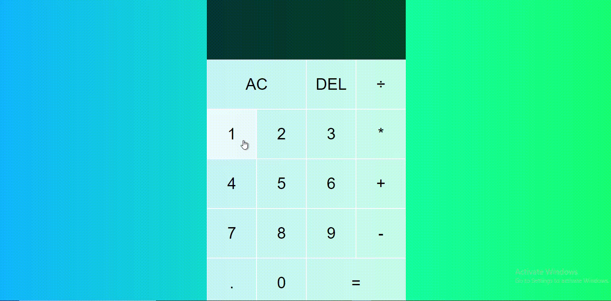

<h1> CALCULATOR </h1>

<h2>  A calculator is an electronic hard-ware device or software capable of performing mathematical calculations, such as addition, multiplication, subtraction, or division. </h2>

<h3> We used html, css and script. </h3>

<h2> Screen Gif </h2>

